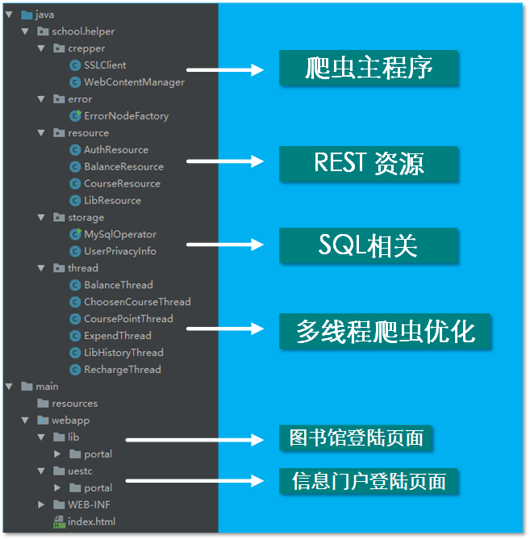

# 微信订阅号-电小科Bot（爬虫后台）

## 目标

1. 与微信后台进行对接，实现微信后台命令的响应。:mega:
2. 网页模拟登陆与爬虫，实现用户数据的抓取。:memo:
3. 数据库操作与优化，实现用户数据的持久化，减少爬虫带来的额外开销。:flags:

## 软件架构

本爬虫后台为 **Crawler** 实体。负责从学校官网模拟登陆抓取信息。同时 **Crawler** 将爬虫抓取的信息存至 :cloud:**MySQL**服务器。与 **Wechat后台** 之间使用 **REST接口** 交互。

**Crawler** 使用 **Java** 作为编程语言，结合 **Jersey** 框架，是一个轻量级的 **REST** 服务器。目前的运行方式是托管在 **ISP** 的 **Tomcat** 服务器上。

## 工程目录一览

## 技术分析

### HttpClient:white_check_mark:

**HTTP** 协议可能是现在 Internet 上使用得最多、最重要的协议了，越来越多的 Java 应用程序需要直接通过 HTTP 协议来访问网络资源。虽然在 JDK 的 java.net 包中已经提供了访问 HTTP 协议的基本功能，但是对于大部分应用程序来说，JDK 库本身提供的功能还不够丰富和灵活。**HttpClient** 是 Apache Jakarta Common 下的子项目，用来提供高效的、最新的、功能丰富的支持 HTTP 协议的客户端编程工具包，并且它支持 HTTP 协议最新的版本和建议。HttpClient 已经应用在很多的项目中，比如 Apache Jakarta 上很著名的另外两个开源项目 Cactus 和 HTMLUnit 都使用了 HttpClient。通过使用 **HttpClient** 库，我们可以很轻松地**模拟登陆**信息门户，爬取整个页面内容，结合**正则表达式**，我们可以批量提取关键内容。

### Jersey:white_check_mark:

**Jersey RESTful** 框架是开源的RESTful框架, 实现了**JAX-RS** (JSR 311 & JSR 339) 规范。它扩展了JAX-RS 参考实现， 提供了更多的特性和工具， 可以进一步地简化 RESTful service 和 client 开发。尽管相对年轻，它已经是一个产品级的 RESTful service 和 client 框架。与Struts类似，它同样可以和hibernate,spring框架整合。 **Jersey** 框架的**可扩展性**和**性能**是我们选择它的主要原因。作为一个 **REST** 框架，它兼顾**性能**和**易用性**。

### MySQL:white_check_mark:

**MySQL** 是 Web 世界中使用最广泛的数据库服务器。**SQLite** 的特点是轻量级、可嵌入，但不能承受高并发访问，适合桌面和移动应用。而 **MySQL** 是为服务器端设计的数据库，能承受高并发访问，同时占用的内存也远远大于 **SQLite**。此外，**MySQL**内部有多种数据库引擎，最常用的引擎是支持数据库事务的**InnoDB**。

使用 **MySQL** 可以轻松地存储用户身份凭证等信息，避免用户重复认证，同时，对于一些用户经常查询的信息也可以存储下面，避免重复爬取带来的时间上的开销。**Java** 语言使用 **JDBC** 库连接 **MySQL**。

## 目前进展

一卡通消费情况查询（余额、消费流水、充值情况）

一卡通消费情况更新（余额、消费流水、充值情况）

图书馆借阅信息查询（部分用户信息可能会爬取失败）

图书馆借阅信息更新（部分用户信息可能会爬取失败）

学分及课程信息查询（外网爬取失败，外网屏蔽？）

## 当前不足

爬虫程序耗费时间比较长

服务器并发性能不好

数据库表结构过于简单

登陆界面太丑
