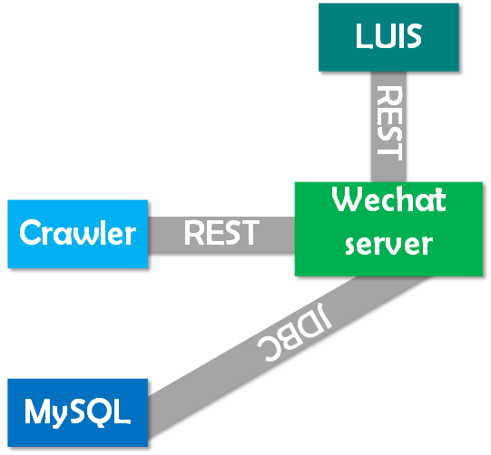
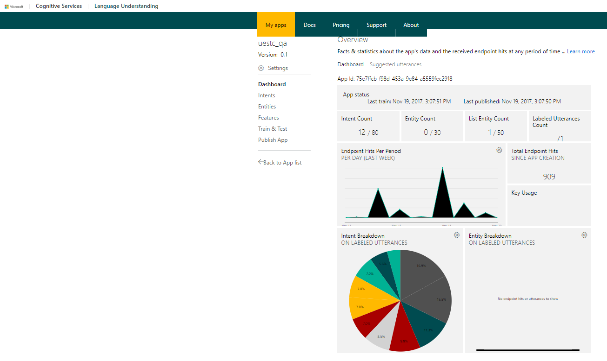
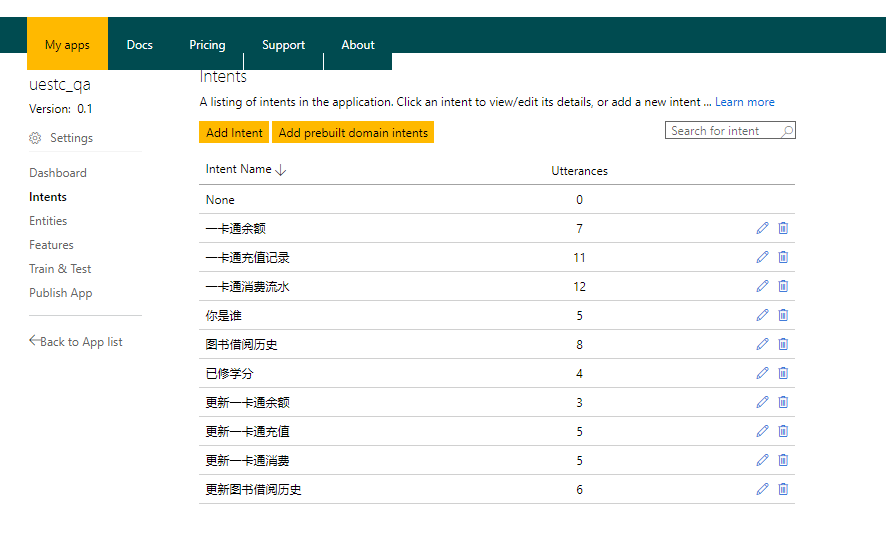
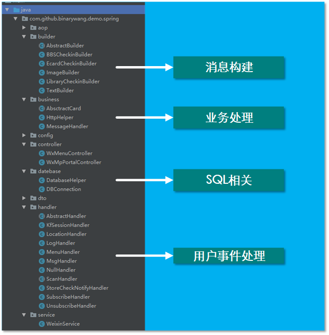

# 微信公众号-电小科Bot(微信服务器)

## 功能

1. 作为微信公众号的后台服务器，对用户数据进行处理。
2. 与[LUIS](https://www.luis.ai/home)进行交互，将用户数据提交给LUIS进行语义识别，并对识别结果进行处理。
3. 根据LUIS语义识别的结果，在数据库查询，并将结果返回给用户。

## 运行方式

1. 使用maven运行demo程序: `mvn jetty:run`
2. 打war包发布到tomcat运行

## 技术分析

### 1、工程结构

#### LUIS:自然语言处理模型

- 仪表盘如下,可以查看当前模型的配置以及被访问的信息。

- 语义意图如下,下表是当前可识别的用户意图

  

#### WechatServer

微信服务器采用[Wechat-Group](https://github.com/Wechat-Group)的Java SDK开发工具包，并基于Spring MVC进行开发。

Spring MVC是Spring框架最重要的的模块之一。Spring 框架提供了构建 Web 应用程序的全功能 MVC 模块。使用 Spring 可插入的 MVC 架构，可以选择是使用内置的 Spring Web 框架还是 Struts 这样的 Web 框架。通过策略接口，Spring 框架是高度可配置的，而且包含多种视图技术，例如 JavaServer Pages（JSP）技术、Velocity、Tiles、iText 和 POI。Spring MVC 分离了控制器、模型对象、分派器以及处理程序对象的角色，这种分离让它们更容易进行定制。

### 2、工程目录

## 目前进展:triangular_flag_on_post:

支持一卡通消费情况查询（余额、消费流水、充值情况）

支持一卡通消费情况更新（余额、消费流水、充值情况）

图书馆借阅信息查询，借阅更新等业务处理已经实现，等待爬虫服务器更新

学分及课程信息查询，业务处理已经实现，等待爬虫服务器更新

## 当前不足

当前只支持微信文字查询，不支持图片请求以及语音业务

LUIS语义识别智能程度不够高，不能做到完全

## 下一步方向:eyes:

- 完善LUIS，增加更多的语义识别，实现更多查询功能，提高语义识别的智能化成都
- 优化对数据库的访问，减少访问时间，加快相应速度。